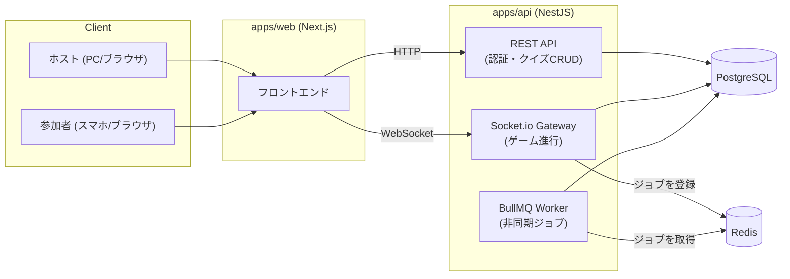
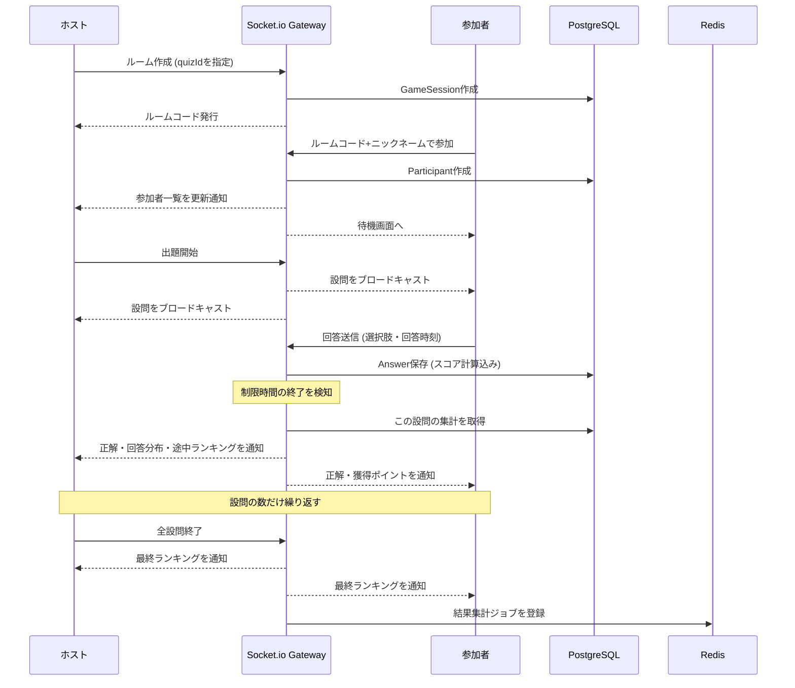

# 🏗️ アーキテクチャ設計書 (neo-hoot)

`docs/spec.md`（何を作るか）と`docs/er.md`（データ構造）を踏まえて、システムをどう組み立てるかを整理する。

## 1. 全体構成

## 2. 通信方式の使い分け（REST vs WebSocket）

すべてをWebSocketにするのではなく、性質に応じて使い分ける。

| 通信方式                   | 用途                                                   | 具体例                                                           |
| :------------------------- | :----------------------------------------------------- | :--------------------------------------------------------------- |
| **REST（HTTP）**           | 「今すぐ結果が返れば十分」な、単発の操作               | OAuthログイン、クイズの作成・編集・一覧取得、ルームの新規開催    |
| **WebSocket（Socket.io）** | 複数人の状態をリアルタイムに同期し続ける必要がある操作 | ルーム参加、出題、回答送信、途中経過・最終結果のブロードキャスト |

クイズの編集画面のように「自分1人だけが操作していて、リアルタイム同期が不要な画面」はRESTで十分。ルーム開催中は、ホストと全参加者の画面を同時に書き換える必要があるためWebSocketを使う。

## 3. リアルタイム進行のシーケンス

## 4. BullMQ（非同期ジョブ）の使いどころ

リアルタイム性が必要な処理（得点計算・進行）は同期的にその場で行うが、以下の2つは非同期ジョブとして切り出す。

### 4-1. セッション終了後の結果集計ジョブ

- **トリガー**: 全設問が終了し、ホストがセッションを終了した時
- **やること**: 参加者ごとの正答率、設問ごとの正答率、平均回答時間などの詳細な統計を集計し、結果として保存する
- **なぜ非同期にするか**: 「最終ランキングを表示する」という即座に必要な処理とは分離し、重い集計処理でゲーム終了の体感速度を落とさないため

### 4-2. 放置ルームの自動クリーンアップジョブ（遅延ジョブ）

- **トリガー**: ルーム作成時に、「一定時間後」に実行される遅延ジョブを同時に登録する
- **やること**: 指定時間が経過した時点で、そのセッションがまだ`waiting`（開始されていない）状態なら`expired`に変更する
- **なぜ非同期にするか**: 「〇時間後に確認する」という時間差の処理は、リクエスト/レスポンスの流れの中では表現できないため、BullMQの遅延ジョブ機能を使う

## 5. Redisの2つの役割

- **BullMQのバックエンド**: ジョブキューの状態management（今回追加した用途）
- **Socket.ioのスケーリング用アダプター（将来的な拡張余地）**: 複数のNestJSインスタンスを並べる場合、WebSocketの接続情報をインスタンス間で共有するために使う。今回はローカルでインスタンス1つのみの想定のため、当面は導入しない。

## 6. 認証フロー（ホストのOAuthログイン）

1. ホストが`apps/web`でログインボタンを押す
2. `apps/api`のOAuthエンドポイントへリダイレクトされる
3. Google/GitHub等の認証画面へ遷移し、認可後にコールバックURLへ戻る
4. `apps/api`がユーザー情報を取得し、`USER`テーブルに保存（初回のみ）またはユーザーを特定
5. セッション情報をJWTとしてhttpOnly Cookieに設定し、`apps/web`側へリダイレクト

参加者はこのフローを一切経由せず、ニックネーム入力のみでルームに参加する。

## 7. アカウント削除の実装方針

`docs/er.md`の「削除時の連鎖動作」の通り、`GAME_SESSION.quiz_id`や`ANSWER.question_id`/`choice_id`は開催履歴を保護するため、通常は削除を拒否する制約（デフォルトのRESTRICT）にしている。一方で、ユーザーがアカウントを削除する場合は、その履歴も含めて全データを削除したい。

DBの外部キー制約（`ON DELETE CASCADE`）だけではこの両立はできない（制約は「なぜ削除するのか」を区別できないため）。そのため、アカウント削除はAPI側で明示的な順序付きの一括削除処理として実装する。

1. 対象ユーザーが作成した各クイズについて、`ANSWER` → `PARTICIPANT` → `GAME_SESSION` → `CHOICE` → `QUESTION`の順に削除
2. `QUIZ`を削除
3. `USER`を削除

通常のクイズ編集画面からの削除操作はこの処理を経由せず、DBの制約通りブロックされたままにする（開催済みのクイズ・設問・選択肢は編集画面から削除できない）。
