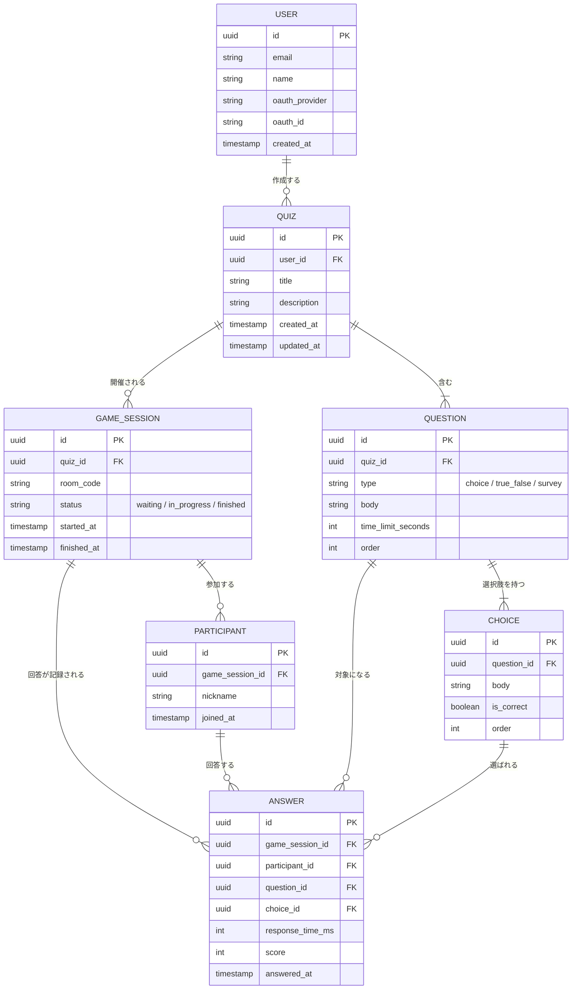

# 🗂️ ER図 (neo-hoot)

`docs/spec.md`の機能仕様から導き出したエンティティとその関係。実装時の`packages/db`のDrizzleスキーマは、このER図を元に作成する。

## エンティティ関係図

## 補足

- **QUIZ ↔ GAME_SESSION**: 1つのクイズ（テンプレート）から、何度でもゲームセッション（開催）を作れる1対多の関係（`spec.md`の「データの2層構造」に対応）。
- **PARTICIPANT**: `USER`とは無関係の独立したエンティティ。アカウント不要の参加者を表す。
- **USER.oauth_provider / oauth_id**: 認証実装時に、同じメールアドレスで別プロバイダーからログインした場合はこの2つを新しいプロバイダーの値で上書きする（アカウント連携。詳細は`docs/architecture.md`参照）。値が変わりうるカラムのため、`(oauth_provider, oauth_id)`への複合ユニーク制約はまだ付けていない（TODO: 同時ログイン等の競合で重複が生まれる可能性はゼロではないため、将来的に検討する）。
- **ANSWER**: 「誰が」「どのセッションの」「どの設問に」「どの選択肢を」「何ミリ秒で」回答したかを1レコードで表す。`score`は正解・回答速度から計算した結果を保存する（毎回計算し直さずに済むように）。
- **未回答の表現**: 制限時間内に回答しなかった参加者については、`ANSWER`の行自体を作らない（`choice_id`をNULL許容にして「未回答」を表す方式は採らない）。「回答済み人数」は該当設問に紐づく`ANSWER`の件数を数えるだけで求まり、`choice_id`が常に「実際に選ばれた選択肢」を指すため意味が曖昧にならない。
- **QUESTION.type**: `choice`（4択）, `true_false`（○×）, `survey`（アンケート）の3種類。アンケートの場合、対応する`CHOICE`の`is_correct`はすべて`false`になる。
- **QUESTION**に上限数の制約は設けない（1問以上であれば任意の数）。
- **`survey`タイプの選択肢数**: 最低2、最大6。`choice`（常に4）・`true_false`（常に2）とは異なり可変だが、`.survey-list`（縦積みリスト表示）が見やすさを保てる範囲に収める。
- **`QUESTION.order` / `CHOICE.order`の重複禁止**: 同じ`QUIZ`内の`QUESTION.order`同士、および同じ`QUESTION`内の`CHOICE.order`同士は重複してはいけない（表示順が意味を成さなくなるため）。API側（DTOのカスタムバリデータ）でチェックする。

## 削除時の連鎖動作（ON DELETE）

「一度でも実際に使われたデータ（開催履歴）は保護し、まだ使われていないテンプレート部分は親と一緒に削除してよい」という方針で統一する。

| 関係                           | ON DELETE                    | 理由                                                               |
| :----------------------------- | :--------------------------- | :----------------------------------------------------------------- |
| `USER` → `QUIZ`                | CASCADE                      | ユーザーが削除されたら、そのユーザーが作成したクイズも削除する     |
| `QUIZ` → `QUESTION`            | CASCADE                      | クイズが無ければ設問は意味を持たない                               |
| `QUESTION` → `CHOICE`          | CASCADE                      | 設問が無ければ選択肢は意味を持たない                               |
| `GAME_SESSION` → `PARTICIPANT` | CASCADE                      | セッションが無ければ参加者は意味を持たない                         |
| `GAME_SESSION` → `ANSWER`      | CASCADE                      | 同上                                                               |
| `PARTICIPANT` → `ANSWER`       | CASCADE                      | 同上                                                               |
| `QUIZ` → `GAME_SESSION`        | 制限（デフォルト、指定なし） | 一度でも開催されたクイズは削除できないようにし、開催履歴を保護する |
| `QUESTION` → `ANSWER`          | 制限（デフォルト、指定なし） | 実際に回答された設問は削除できないようにし、回答履歴を保護する     |
| `CHOICE` → `ANSWER`            | 制限（デフォルト、指定なし） | 同上（選択肢について）                                             |

**アカウント削除との整合性について**: `USER`→`QUIZ`のCASCADEと`QUIZ`→`GAME_SESSION`の制限は、そのままでは矛盾する（開催履歴のあるクイズを持つユーザーを削除しようとすると、連鎖の途中でブロックされる）。DBの制約だけでは「なぜ削除するか」を区別できずこの矛盾を解決できないため、アカウント削除はAPI側で明示的な順序付き削除処理として実装する。詳細は`docs/architecture.md`の「アカウント削除の実装方針」を参照。

## フィールドごとの制約

| フィールド                    | 制約                        | 理由                                                                                             |
| :---------------------------- | :-------------------------- | :----------------------------------------------------------------------------------------------- |
| `QUIZ.title`                  | 最大30文字                  | ダッシュボードのカード幅（320px）・編集画面の見出しに1行で収まる範囲                             |
| `QUIZ.description`            | 最大60文字                  | カード内の説明文として1〜2行に収まる範囲                                                         |
| `QUESTION.body`               | 最大100文字                 | プロジェクター投影時の可読性とテンポを両立できる範囲                                             |
| `CHOICE.body`                 | 最大20文字                  | 正方形の選択肢ボタン（`aspect-ratio: 1`）に収める必要があるため、ニックネームより厳しめに制限    |
| `PARTICIPANT.nickname`        | 最大20文字                  | チップやリストの表示幅に収まる範囲で、かつ入力の自由度も確保するバランス                         |
| `QUESTION.time_limit_seconds` | 5秒〜120秒                  | 5秒未満は回答不可能に近く、120秒を超えるとテンポが悪くなるため                                   |
| `GAME_SESSION.room_code`      | 4桁の数字（`0000`〜`9999`） | ランダム生成し、`status`が`waiting`または`in_progress`の既存セッションと重複した場合は再生成する |
