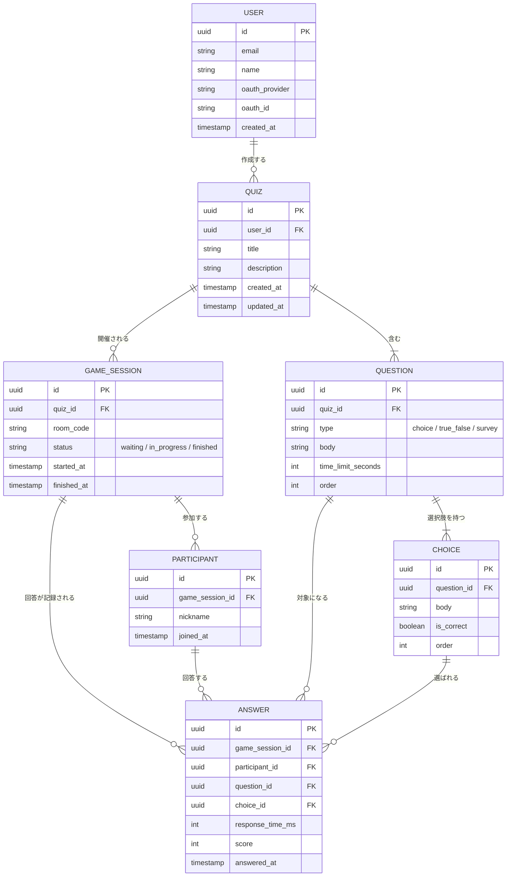

# 🗂️ ER図 (neo-hoot)

`docs/spec.md`の機能仕様から導き出したエンティティとその関係。実装時の`packages/db`のDrizzleスキーマは、このER図を元に作成する。

## エンティティ関係図

## 補足

- **QUIZ ↔ GAME_SESSION**: 1つのクイズ（テンプレート）から、何度でもゲームセッション（開催）を作れる1対多の関係（`spec.md`の「データの2層構造」に対応）。
- **PARTICIPANT**: `USER`とは無関係の独立したエンティティ。アカウント不要の参加者を表す。
- **ANSWER**: 「誰が」「どのセッションの」「どの設問に」「どの選択肢を」「何ミリ秒で」回答したかを1レコードで表す。`score`は正解・回答速度から計算した結果を保存する（毎回計算し直さずに済むように）。
- **QUESTION.type**: `choice`（4択）, `true_false`（○×）, `survey`（アンケート）の3種類。アンケートの場合、対応する`CHOICE`の`is_correct`はすべて`false`になる。
- **QUESTION**に上限数の制約は設けない（1問以上であれば任意の数）。
- **`survey`タイプの選択肢数**: 最低2、最大6。`choice`（常に4）・`true_false`（常に2）とは異なり可変だが、`.survey-list`（縦積みリスト表示）が見やすさを保てる範囲に収める。

## フィールドごとの制約

| フィールド                    | 制約                        | 理由                                                                                             |
| :---------------------------- | :-------------------------- | :----------------------------------------------------------------------------------------------- |
| `QUIZ.title`                  | 最大30文字                  | ダッシュボードのカード幅（320px）・編集画面の見出しに1行で収まる範囲                             |
| `QUIZ.description`            | 最大60文字                  | カード内の説明文として1〜2行に収まる範囲                                                         |
| `QUESTION.body`               | 最大100文字                 | プロジェクター投影時の可読性とテンポを両立できる範囲                                             |
| `CHOICE.body`                 | 最大20文字                  | 正方形の選択肢ボタン（`aspect-ratio: 1`）に収める必要があるため、ニックネームより厳しめに制限    |
| `PARTICIPANT.nickname`        | 最大20文字                  | チップやリストの表示幅に収まる範囲で、かつ入力の自由度も確保するバランス                         |
| `QUESTION.time_limit_seconds` | 5秒〜120秒                  | 5秒未満は回答不可能に近く、120秒を超えるとテンポが悪くなるため                                   |
| `GAME_SESSION.room_code`      | 4桁の数字（`0000`〜`9999`） | ランダム生成し、`status`が`waiting`または`in_progress`の既存セッションと重複した場合は再生成する |
